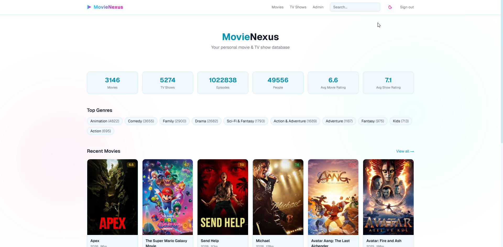
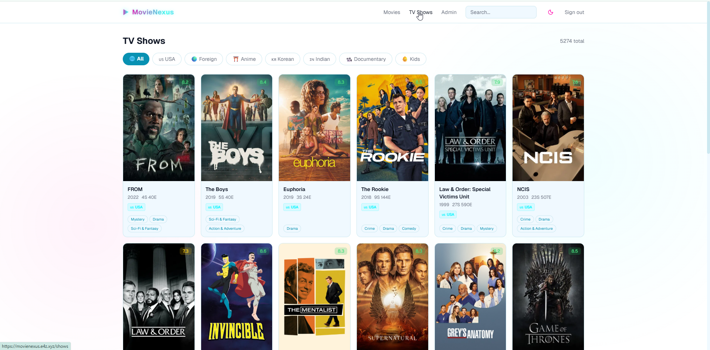

# MovieNexus

A full-featured movie and TV show database platform. Import from TMDb, TVDb, Plex, Trakt. Export to JSON/CSV/XML. Browse by category, filter by genre, and explore comprehensive metadata with multi-source ratings.

[](./VERSION)
[](#license)
[](https://github.com/trickdaddy24/movie-nexus)

## Screenshots





## Features

- Multi-source import pipeline (TMDb, Fanart.tv, Plex)
- 8 browsing categories: All, USA, Foreign, Anime, Korean, Indian, Documentary, Kids
- Clickable genre tags with filtered browsing
- Multi-source ratings: TMDb, IMDb, Trakt
- Plex Media Server integration with per-library sync, artwork refresh, Telegram notifications
- Poster source ordering: Plex > TMDb > Fanart, English preferred
- Admin dashboard with live SSE import monitor, bulk import, artwork verification
- Dedicated Plex dashboard with per-library progress cards and activity feed
- Auth.js v5 admin authentication with hidden superadmin
- Export to JSON, CSV, XML
- Nightly scheduled jobs: Plex sync, trending snapshots, rating sync, database backup
- Telegram notifications for imports, syncs, and backfills

## Architecture

| Component | Technology |
|-----------|------------|
| Backend | FastAPI + async SQLAlchemy (asyncpg) |
| Database | PostgreSQL 16 |
| Frontend | Next.js 15 + React 19 + Tailwind CSS |
| Cache | Redis 7 |
| Auth | Auth.js v5 + Prisma + SQLite |
| Scheduler | APScheduler |
| Deployment | Docker Compose + Traefik |
| Data Sources | TMDb, Fanart.tv, Trakt, Plex |

## Quick Start

```bash
# Clone
git clone https://github.com/trickdaddy24/movie-nexus.git
cd movie-nexus

# Setup environment
cp .env.example .env
# Edit .env with your API keys

# Start services
docker compose up -d

# Backend: http://localhost:8910/docs
# Frontend: http://localhost:3210
```

## Environment Variables

See `.env.example` for all required variables:
- `TMDB_API_KEY` — required
- `TVDB_API_KEY` — required for TV data
- `FANART_API_KEY` — artwork enrichment
- `TRAKT_CLIENT_ID` — ratings
- `PLEX_URL` / `PLEX_TOKEN` — library sync
- `TELEGRAM_BOT_TOKEN` / `TELEGRAM_CHAT_ID` — notifications

## Deployment

```bash
# Standard deploy (pull latest, rebuild, restart)
./scripts/deploy.sh main

# Check status
./scripts/deploy.sh status
```

### Backup & Recovery

Automated daily backups run via cron at 3:00 AM. Retention: 7 daily + 4 weekly.

```bash
./scripts/backup-db.sh          # Manual backup
./scripts/restore-db.sh         # Restore from latest
```

## ID System

| Type | Format | Example |
|------|--------|---------|
| Movie | `ms{N}` | `ms1`, `ms550` |
| TV Show | `tv{N}` | `tv1`, `tv1399` |
| Episode | `es{N}` | `es1`, `es12345` |

11 media types supported. External IDs (TMDb, IMDb, TVDb) stored separately and displayed with links on detail pages.

## Version History

| Version | Date | Highlights |
|---------|------|------------|
| 0.11.0 | 2026-04-30 | Daily heartbeat health check — monitors all 4 Docker services, reports to Telegram at random time |
| 0.10.0 | 2026-04-29 | Chunked full Plex sync with adaptive pacing, Redis crash recovery, Telegram batch notifications |
| 0.9.0 | 2026-04-30 | Two-tier API key protection, emergency admin bypass token, Swagger UI gating |
| 0.8.0 | 2026-04-29 | Clickable genres, ID row on detail pages, TV artwork fix, admin dark mode fix |
| 0.7.0 | 2026-04-29 | Dedicated Plex Dashboard, per-library tracking, Telegram sync notifications |
| 0.6.0 | 2026-04-29 | Plex integration: library sync, artwork refresh, nightly scheduler |
| 0.5.0 | 2026-04-28 | 8 browsing categories, origin badges, category-filtered imports |
| 0.4.0 | 2026-04-27 | Admin interface, SSE import monitor, export downloads |
| 0.3.0 | 2026-04-27 | Bulk import, Trakt, trending, nightly jobs, Telegram |
| 0.2.0 | 2026-04-18 | Dark/light theme, LogoBrand component |
| 0.1.0 | 2026-04-17 | Foundation: backend, frontend, import pipeline, search, export |

See [CHANGELOG.md](./CHANGELOG.md) for full details.

## License

MIT — see [LICENSE](./LICENSE)
